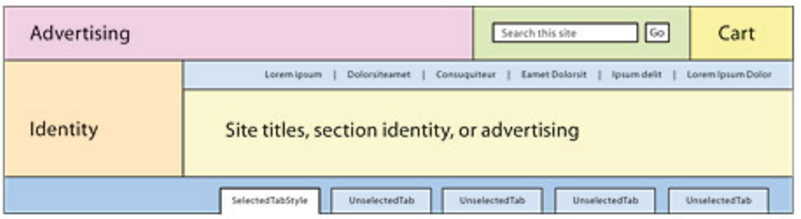

class: center, middle

# Website Structure and Paper Prototype

---

# Agenda

##1. General Website Structure
##2. Building Paper Prototype

---

# General Website Structure

---

#Header

---

# Paper Prototype

#### - Create a prototype on paper
####     - Common practice in UX (User eXperience) design

---
# Wireframe

## - another name for paper prototype

---

# Reference

- Web Style Guide (http://webstyleguide.com/wsg3/index.html)